# Yuqing：流程 · 思维导图 · 架构图

> **Yuqing** 是社交媒体舆情 / 观众反馈工作台：文件导入 / B 站评论采集 → 本地 GPU 情感 / 主题分析 → 趋势预警 → 报告导出。不局限于校园场景。  
> **一期已结项：** Vue 3 工作台 + FastAPI BFF + SQLite；**无登录**；采集为文件导入。  
> **二期已落地：** 外挂 MediaCrawler 转换导入；**内嵌 B 站评论采集**；轻量 Agent（问答 + 简报）。  
> 下图均为 Mermaid，可在支持 Mermaid 的编辑器中预览。目录细则见 [`directory-structure.md`](./directory-structure.md)，真实采集见 [`real-data-collection.md`](./real-data-collection.md)。

---

## 1. 用户主流程

### 1.1 演示闭环（导入 → 分析 → 图表 → 报告）

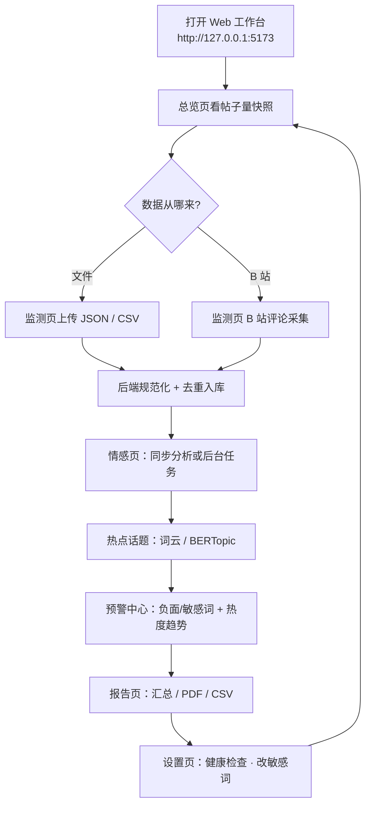

### 1.2 单次文件导入

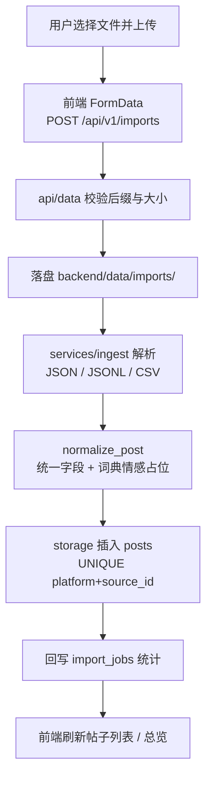

### 1.2b B 站评论采集（内嵌）

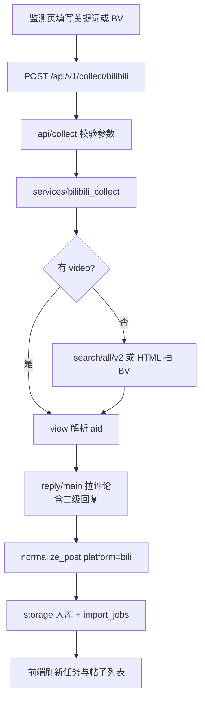

### 1.3 情感分析（同步 vs 异步）

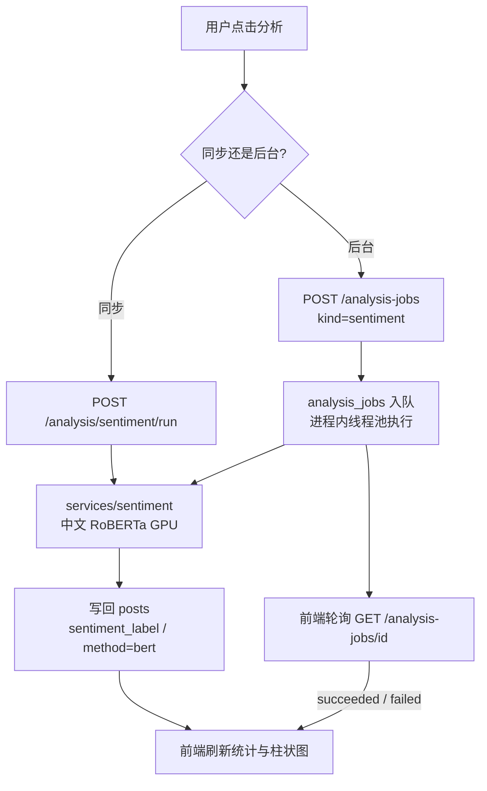

### 1.4 报告导出（含可选 AI 摘要）

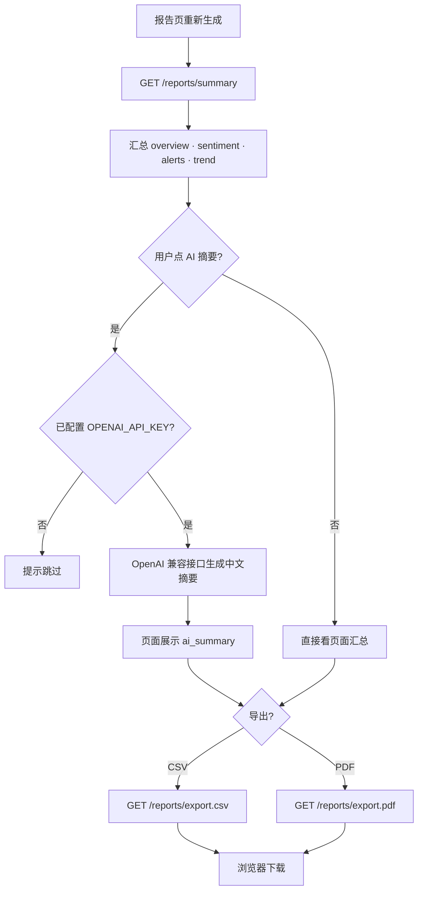

### 1.5 版本演进路线（产品流程视角）

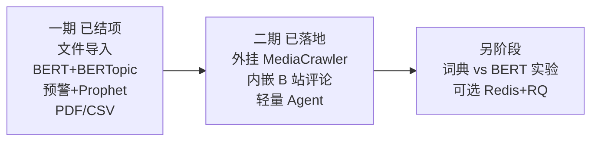

---

## 2. 产品思维导图

### 2.1 总览

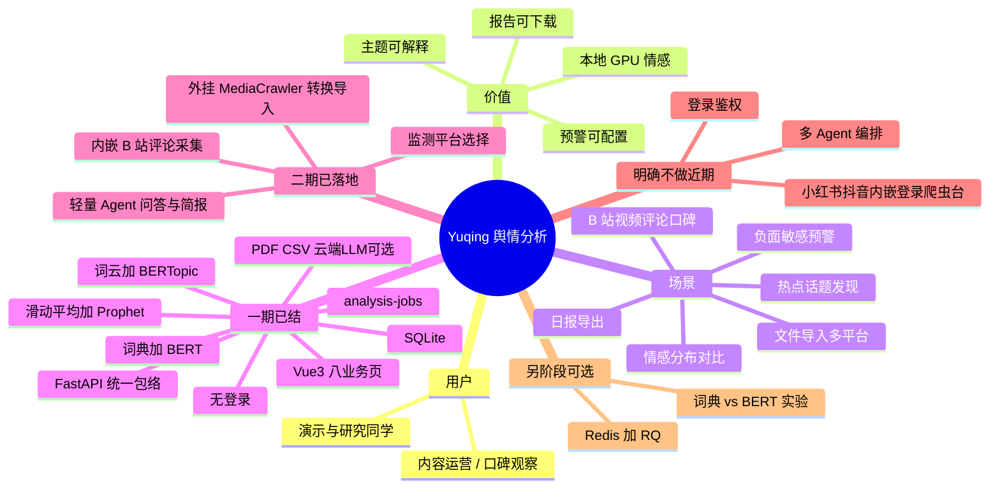

### 2.2 功能模块脑图（研发拆分视角）

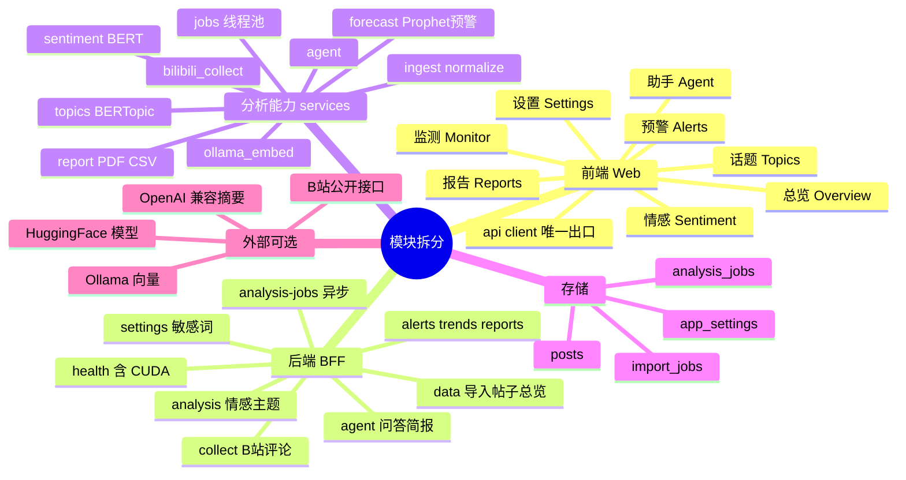

---

## 3. 项目架构图

### 3.1 系统逻辑架构（一期）

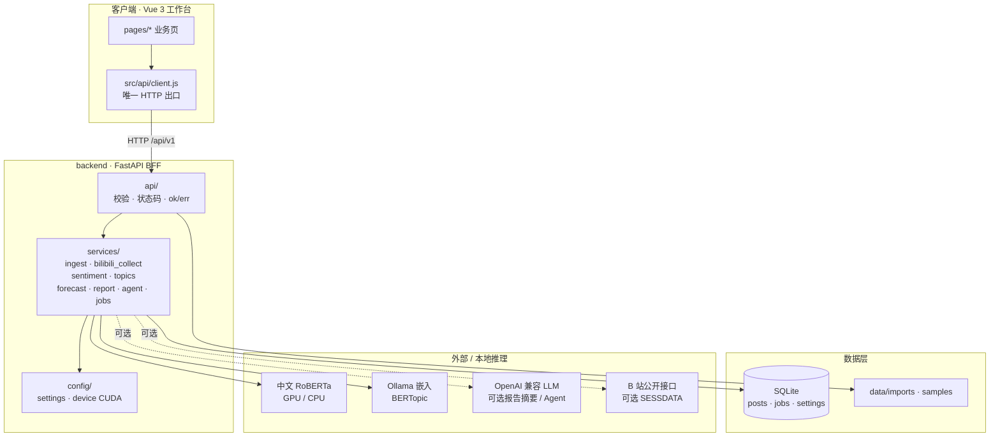

**调用关系一句话：**

```text
浏览器 → frontend/src/api → backend/src/api → services → storage
设备与模型配置只出自 config/；SQLite 只经 storage/
```

### 3.2 导入 → 情感 → 预警 时序

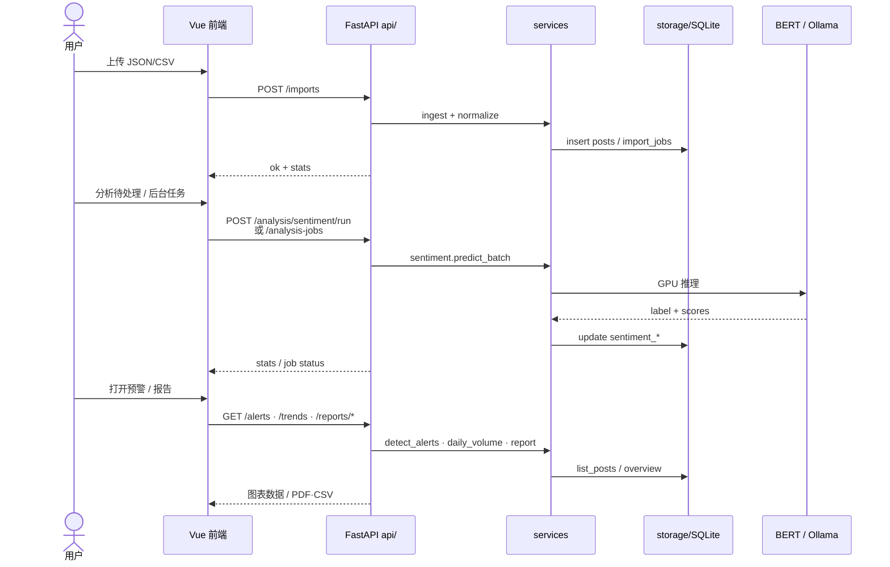

### 3.3 仓库目录结构

```mermaid
flowchart TB
    ROOT[yuqing/]
    ROOT --> DOCS[docs/<br/>directory-structure · diagrams]
    ROOT --> TRE[/.trellis/<br/>MERGE_PLAN · GATE]
    ROOT --> FE[frontend/<br/>Vue 3]
    ROOT --> BE[backend/<br/>FastAPI]
    ROOT --> VEN[vendor/<br/>参考仓只读]

    FE --> F1[src/pages · router · components]
    FE --> F2[src/api 唯一 HTTP]

    BE --> B1[src/api]
    BE --> B2[src/services]
    BE --> B3[src/storage · config · lib]
    BE --> B4[data/ 运行时 · scripts/]
```

**文字版目录（摘要；细目见 directory-structure.md）：**

```text
yuqing/
├── README.md
├── AGENTS.md
├── docs/
│   ├── directory-structure.md   ← 目录与 API 垂直表
│   ├── diagrams.md              ← 本文件
│   └── README.md
├── .trellis/                    ← 合并方案与阶段门禁
├── frontend/
│   └── src/{pages,api,router,components,assets}
├── backend/
│   ├── main.py
│   ├── src/{api,services,storage,config,lib}
│   ├── data/                    ← DB / imports / samples（gitignore）
│   ├── scripts/                 ← 样例生成、冒烟
│   └── docs/                    ← 后端专用备忘
├── vendor/                      ← 参考仓，非运行时
└── pyproject.toml               ← uv + 根 .venv
```

### 3.4 数据关系（概念）

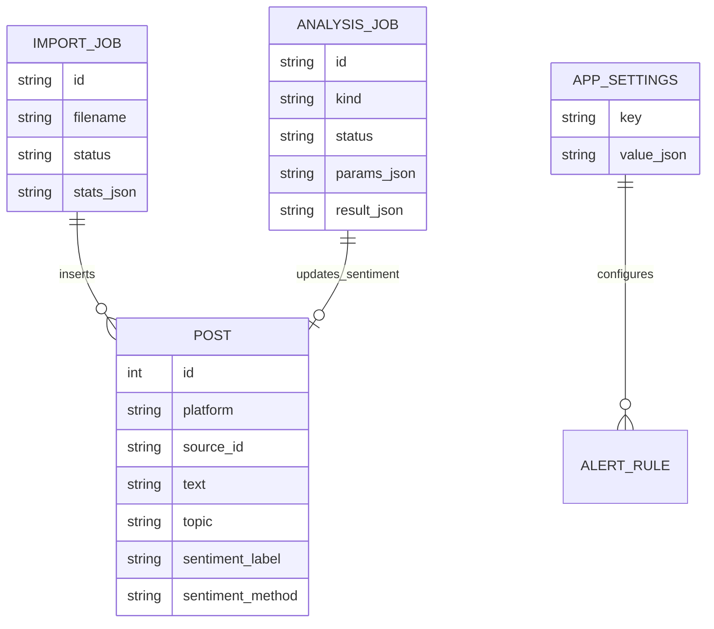

> 说明：`ALERT_RULE` 为逻辑概念；现行实现是 `app_settings.key=alert_keywords` 的词表，由 `services/forecast.detect_alerts` 消费。

### 3.5 前后端 API 垂直对照

| 前端能力 | `frontend/src/api` | 后端路由 |
|----------|-------------------|----------|
| 健康 / CUDA | `fetchHealthReady` | `/api/v1/health/*` |
| 总览 / 帖子 / 导入 / 清理 | `fetchOverview` · `fetchPosts` · `uploadImport` · `deletePosts` | `/dashboard/overview` · `/posts` · `/posts/delete` · `/imports` |
| B 站采集 | `collectBilibili` | `/collect/bilibili` |
| 情感 / 主题 | `runSentiment` · `runTopics` · … | `/analysis/sentiment*` · `/analysis/topics*` |
| 异步任务 | `createAnalysisJob` · `fetchAnalysisJob` | `/analysis-jobs` |
| 预警 / 趋势 | `fetchAlerts` · `fetchTrends` | `/alerts` · `/trends` |
| 报告 / 视频口碑 | `fetchReportSummary` · `fetchVideoReport` · `fetchVideoSummaries` · export | `/reports/summary` · `/reports/video` · `/reports/videos` · `/reports/export.*` |
| 助手 | `agentChat` · `agentBrief`（可选 `bvid`） | `/agent/chat` · `/agent/brief` |
| 敏感词 | `fetchAlertKeywords` · `saveAlertKeywords` | `/settings/alert-keywords` |

统一响应：`{ "ok": true, "data": ... }` / `{ "ok": false, "error": { "code", "message" } }`。

---

## 4. 页面信息架构

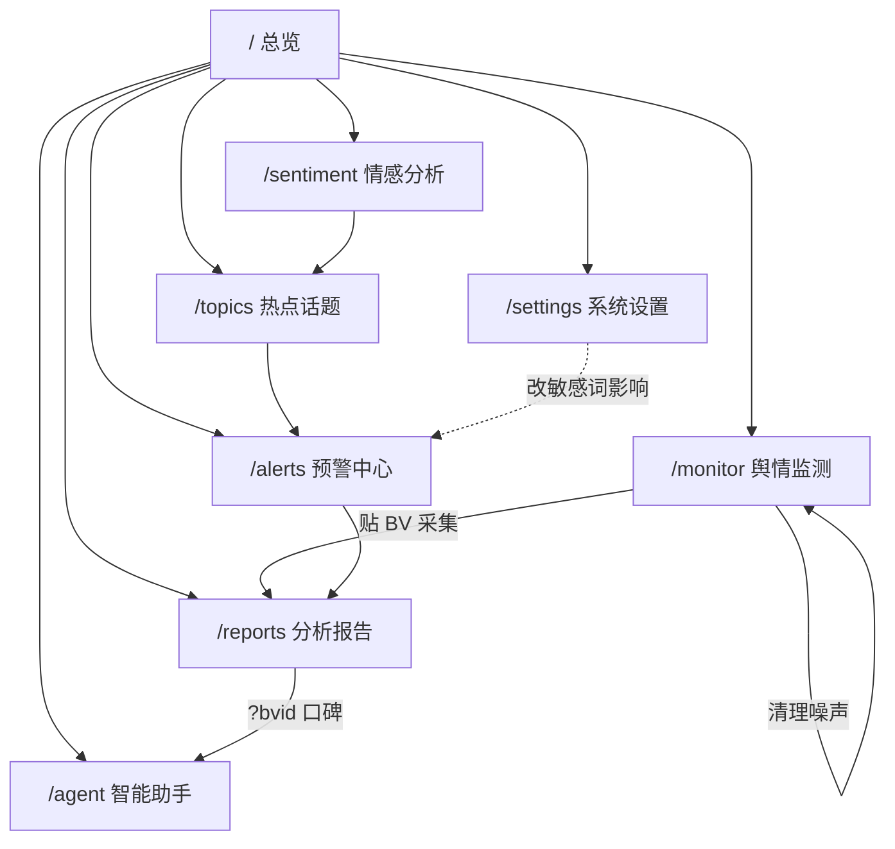

**已有：** 总览、监测（BV 采集 / 导入 / 噪声清理）、情感、话题、预警（含 Prophet 趋势）、报告（全局汇总 + 单视频口碑）、助手（可选 BV 观众反馈）、设置（健康 + 敏感词）。  
**没有：** 登录页、家长/权限页、爬虫配置台、多 Agent 画布。

---

## 5. 图例说明

| 图 | 用途 |
|----|------|
| §1 流程图 | 演示闭环、导入、情感同步/异步、报告导出怎么走 |
| §2 思维导图 | 范围边界、模块拆分、防范围膨胀 |
| §3 架构图 | `api → services → storage`、目录落地、数据关系、API 对照 |
| §4 信息架构 | 八个业务页有哪些、没有哪些 |

如需导出 PNG/SVG，可用 Mermaid CLI 或 IDE 插件对上述代码块导出。
